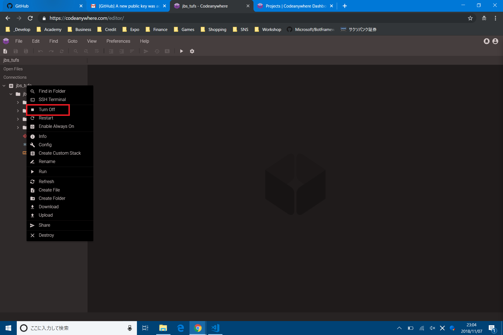

# Codeanywhereの使い方を覚える
Codeanywhereの基本的な使い方を覚えましょう.

## ContainerをBuildする
Webサイト, 画像, 動画, プログラムなど, すべてのIT情報はマシンがなければ存在することができません. インターネットの向こう側にも, 何らかのマシンが必要なのです. Codeanywhereで開発するためには, コンテナとよばれる特殊な仮想マシンを作る必要があります.

左上のメニューから`File` -> `New Project`をクリックします.

いろいろなコンテナがありますが, 今回は`Blank`, `Ubuntu`を使います.(もしかしたら18.04になっているかもしれません.) 選択して, Createをクリックします.

しばらくすると, コンテナが作られて, 起動します. 赤枠のところが何もなくなれば, 起動完了です.

## Containerの情報を見る
ダッシュボードから`Projects`に入るといろいろできます. ちなみに, コンテナを削除しても, 無料枠が増えたりはしません.

## Containerを停止する
起動したままだと, 無料枠がどんどん減っていくので, コンテナを止めます.また, セキュリティ上よろしくないので, 開発終了時にもコンテナを止めます.

コンテナ名を右クリックします.

メニューが出てくるので, `Turn off`をクリックします.

## ContainerのTerminalに接続する
コンテナにはスマホのような, グラフィカルな画面がありません. コンテナ内のアプリケーションを使うには, 操作用の｢文字しかない, 黒い画面｣を使う必要があります. コンテナの場合は黒い画面のことを,`Terminal`と呼びます. (ChromeやEdgeなどのブラウザの場合は, `Console`と呼んでいました. この講義は文字列を表示させるのに使っていましたが, あれは実は操作用の画面なのです.)

先程と同様に, 右クリックメニューから`SSH Terminal`を選びます.

この画面がTerminalです. 今後, よく使うことになるので, 覚えておいてください.

## Container内にファイルやフォルダを作る
先程と同様に, 右クリックメニューから`Create File`, `Create Folder`をクリックします. アップロードもダウンロードもあります. 一通り試しておくと, 役に立つかもしれません.

