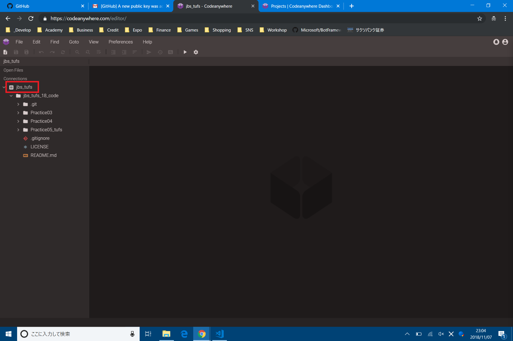
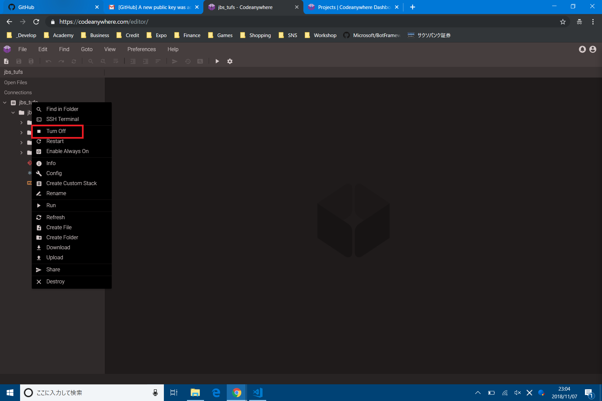

# 開発に必要なアカウントを取得しよう

今回はGithubとCodeanywhereを使います.

## Githubアカウントを取得する

Githubは最もよく使われているGitホスティングサービスです. ソースコードの管理, 開発, 共有, さらにはプロジェクトの課題管理や, 開発に協力してくれるユーザーとのコミュニケーションサイトとして, 現在の開発には欠かせないツールとなっています. 私達もGithubを使う現代の開発スタイルを身に着けましょう.

[Github.com](https://github.com)にアクセスします. Username, Email, Passwordを入力し`sign up`をクリックします.


`Free`を選択し, `continue`をクリックします.


開発経験を聞かれるので, 正直に答えて`submit`をクリックします.


仮登録が完了しました. 右上の仮アイコンをクリックするとメニューが開くので, `setting`をクリックして設定画面に飛びます.


`Emails`に警告が表示されてるので, クリックします. すると`Unverified` = ｢メールアドレスが認証されていない｣と言われます.


先程入力したメールアドレスにGithubからメールが来ているので, `Verify email adress` = ｢emailを認証する｣をクリックします.


設定画面に戻ると警告がきえているはずです. これで本登録ができました.


(任意:推奨)
セキュリティの設定をします. Githubに限らず, セキュリティの設定は必ずするようにしましょう. `Two factor authentication` = ｢2段階認証/2要素認証｣です. Githubでは, SMSを使うか,アプリ(Google認証システム など)を使うか選べます. 2段階認証を設定したあとは, スマホをなくしたり, 機種変更などでうっかりアクセス不可能にならないように気をつけましょう. よくわからない人は, いったん飛ばしてください. 講義後に一緒に設定しましょう.


## Codeanywhereアカウントを取得する

統合開発環境を使うことで, 開発効率が格段に上昇します. Codeanywhereはクラウド統合開発環境です. 2時間まで無料でコンテナ(仮想マシン)が使えます.

[https://codeanywhere.com/](https://codeanywhere.com/)にアクセスします. 右上の`sign up`をクリックします.


先程取得したGithubアカウントで登録します. `Sing up with Github`をクリックします.


Githubのサイトに移行し, 権限を与えてよいかと聞かれます. `Authorize Codeanywhere` = ｢Codeanywhereに権限を与える｣をクリックします. 


Githubの時と同様に, メールアドレスの認証をします.


右上の人形アイコンをクリックするとメニューが出るので, ダッシュボードに行きます.


同様に2段階認証をかけましょう. また, Githubとの接続を解除して, アクセス不能にならないように気をつけましょう.


# Codeanywhereの使い方を覚える
Codeanywhereの基本的な使い方を覚えましょう.

## ContainerをBuildする
Webサイト, 画像, 動画, プログラムなど, すべてのIT情報はマシンがなければ存在することができません. インターネットの向こう側にも, 何らかのマシンが必要なのです. Codeanywhereで開発するためには, コンテナとよばれる特殊な仮想マシンを作る必要があります.

左上のメニューから`File` -> `New Project`をクリックします.


いろいろなコンテナがありますが, 今回は`Blank`, `Ubuntu`を使います.(もしかしたら18.04になっているかもしれません.) 選択して, Createをクリックします.


しばらくすると, コンテナが作られて, 起動します. 赤枠のところが何もなくなれば, 起動完了です.


## Containerの情報を見る
ダッシュボードから`Projects`に入るといろいろできます. ちなみに, コンテナを削除しても, 無料枠が増えたりはしません.


## Containerを停止する
起動したままだと, 無料枠がどんどん減っていくので, コンテナを止めます.また, セキュリティ上よろしくないので, 開発終了時にもコンテナを止めます.

コンテナ名を右クリックします.


メニューが出てくるので, `Turn off`をクリックします.


## ContainerのTerminalに接続する
コンテナにはスマホのような, グラフィカルな画面がありません. コンテナ内のアプリケーションを使うには, 操作用の｢文字しかない, 黒い画面｣を使う必要があります. コンテナの場合は黒い画面のことを,`Terminal`と呼びます. (ChromeやEdgeなどのブラウザの場合は, `Console`と呼んでいました. この講義は文字列を表示させるのに使っていましたが, あれは実は操作用の画面なのです.)

先程と同様に, 右クリックメニューから`SSH Terminal`を選びます.


この画面がTerminalです. 今後, よく使うことになるので, 覚えておいてください.


## Container内にファイルやフォルダを作る
先程と同様に, 右クリックメニューから`Create File`, `Create Folder`をクリックします. アップロードもダウンロードもあります. 一通り試しておくと, 役に立つかもしれません.


# Git/Githubの使い方を覚える
Githubを使うにはGitの使い方を覚える必要があります. 通常, Gitを使うにはマシンにGitをインストールする必要があります. 素晴らしいことに, CodeanywhereのコンテナにはGitがインストールされているので, 何もしなくてもGitが使えます. GitはTerminalから使います.

## RepositoryをFolkする (Github)
Repositoryとは, フォルダやファイルを 'ひとかたまり' にしたデータベースのようなものです. 高機能なフォルダみたいなものです. Githubにある他の人のファイルやプログラムに手を加えるためには, 他の人のRepositoryを自分のGithubのRepositoryにコピーする必要があります. このコピーのことをFolkと呼びます. 

まずは, FolkしたいRepositoryにアクセスします. 今回は[https://github.com/toshi-asai/jbs_tufs_18/](https://github.com/toshi-asai/jbs_tufs_18/)にアクセスします.
右上のFolkをクリックします.

しばらく待ちます.

できました.


## RepositoryをCloneする (Git)
GithubにあるRepositoryを操作するために, 自分のマシンにRepositoryをコピーします. このコピーのことをCloneと呼びます.

今, Folkしてきた自分のリポジトリのページに行き, `Clone or Download`をクリックします. Urlが表示されるので, コピーします. コピーボタンをクリックするとコピーできます.

Codeanywhereのコンテナのターミナルを起動します. 以下のコマンドを入力します.
```
git clone %コピーしたアドレス%
```
左のファイルリストにリポジトリのファイルが表示されたら成功です. また, この時, clone元のRepository(Github)には`origin`という名前がついています.


## Repositoryにcommitする

## Repositoryにpushする

## PullRequestを送る


## PullRequestを受け取る


## hogehoge


